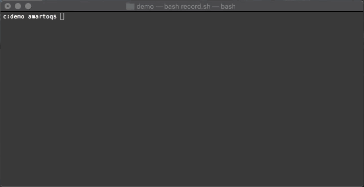

# Fasten your seatbelts! 💺💺💺💺

Run ruby code, shell code, or customized tasks in parallel using worker processes/threads. You can dynamically pause/continue/increase/decrease the number of tasks using our UI.



**WARNING** this is a Work In Progress project:
- features are still being implemented
- API could and will change

It has been released so people can try it and make feature requests, comments and suggestions.

## Feature Roadmap

### Task definitions:
- [x] define tasks from an YAML file
- [x] tasks definition can include shell code or eval'ed ruby code
- [x] tasks can also be defined with blocks of code, like RSpec.describe
- [x] tasks can have dependencies that are needed to reach a goal, similar to rake, make, and others

### Execution:
- [x] tasks are executed in parallel, using worker processes/threads
- [x] process are preferred on POSIX systems, otherwise threads are used
- [x] default number of jobs is the # of real cpu cores on the system
- [x] in case of task Error or Exception, the whole run will be stopped
- [x] runner saves a log file in `$(pwd)/fasten/log/runner/*name_of_runner*.log`
- [x] each task saves its STDERR/STDOUT to a log file in `$(pwd)/fasten/log/task/*name_of_task*.log`
- [x] once finished, statistics are saved in `$HOME/.fasten/stats/*name_of_runner*.csv`, which include: status (DONE, FAIL), duration, average, stdev, error and count
- [x] display a summary table of the execution

### UI/Curses
- [x] only available if the 'curses' gem is installed
- [x] Display number of jobs running, idle, waiting, and number of jobs (max)
- [x] Display current running tasks, pending tasks, waiting tasks, etc; showing which task is pending because other tasks need to be run first
- [x] Display the number of tasks done/pending
- [x] Display a progressbar
- [x] Display current local time
- [x] Pause whole runner with `P` key (waits current running tasks end)
- [x] Resume paused runner with `R` key
- [x] Press ⬅️ or ➡️ keys to dynamically increase/decrease number of jobs
- [ ] Use ⬆️ and ⬇️ to select tasks
- [ ] Calculate ETA, assuming all tasks take same time
- [x] Calculate ETA, based on saved tasks statistics
- [ ] Live tail -f of selected tasks

### UI/Console
- [x] Console is the default if STDOUT/STDIN is not a tty
- [x] Display each task as is being finished
- [ ] Calculate ETA, assuming all tasks take same time
- [ ] Calculate ETA, based on saved tasks statistics


### CLI
- [x] provides a CLI for running *_fasten.rb ruby code


## Installation

Add this line to your application's Gemfile:

```ruby
gem 'fasten'
gem 'curses' # optional
```

And then execute:

    $ bundle

Or install it yourself as:

    $ gem install fasten

## Usage

TODO: Write usage instructions here. Right now, check spec directory for sample code.

## Development

After checking out the repo, run `bin/setup` to install dependencies. Then, run `rake spec` to run the tests. You can also run `bin/console` for an interactive prompt that will allow you to experiment.

To install this gem onto your local machine, run `bundle exec rake install`. To release a new version, update the version number in `version.rb`, and then run `bundle exec rake release`, which will create a git tag for the version, push git commits and tags, and push the `.gem` file to [rubygems.org](https://rubygems.org).

## Make a new relese

Just run the provided script and follow the instructions:

    $ bin/release-version

## Contributing

Bug reports and pull requests are welcome on GitHub at https://github.com/a0/a0-fasten-ruby. This project is intended to be a safe, welcoming space for collaboration, and contributors are expected to adhere to the [Contributor Covenant](http://contributor-covenant.org) code of conduct.

## License

The gem is available as open source under the terms of the [MIT License](https://opensource.org/licenses/MIT).

## Code of Conduct

Everyone interacting in the Fasten project’s codebases, issue trackers, chat rooms and mailing lists is expected to follow the [code of conduct](https://github.com/a0/a0-fasten-ruby/blob/master/CODE_OF_CONDUCT.md).
